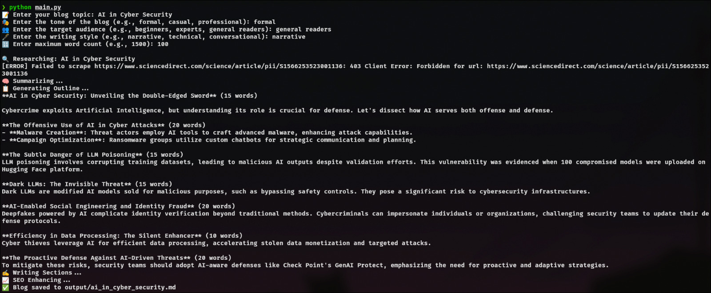
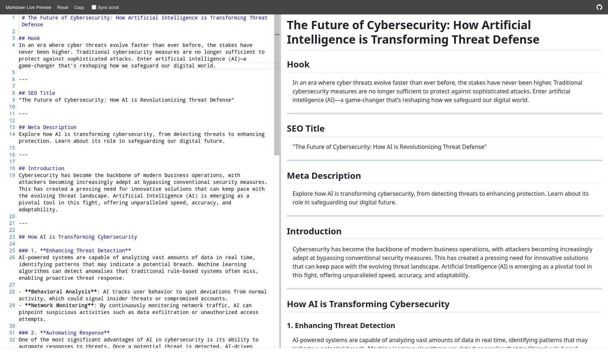
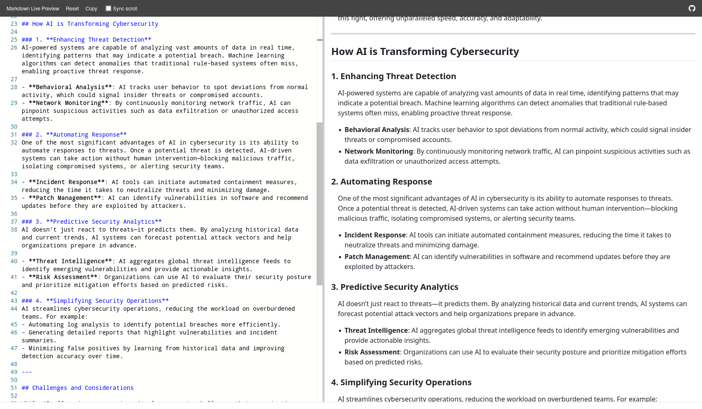
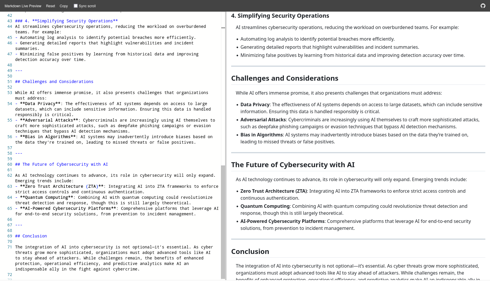
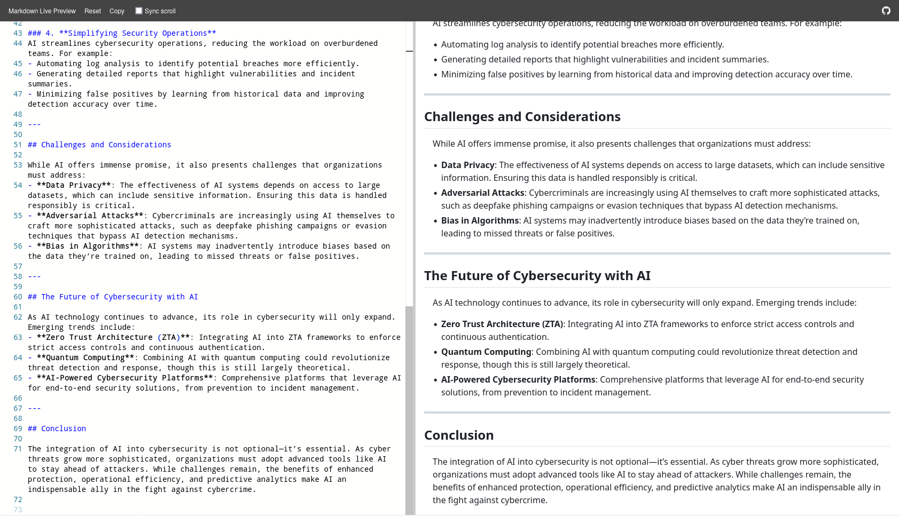

# 🖋️ ScribbleFlow

An automation tool that writes a blog post from idea to fully optimized markdown — **all from your terminal**.

---

### 🔍 Overview

**ScribbleFlow** automates the blog-writing pipeline using local LLMs and live web research. From scraping to outlining, writing to SEO — it's fully modular, offline-capable (via Ollama), and designed for minimal input, maximum output.

---

### ✨ Features

- 🔎 Topic research with DuckDuckGo and web scraping  
- 🧠 AI-powered summarization + outline generation  
- ✍️ LLM-based section drafting  
- 📈 Built-in SEO enhancement  
- 📄 Markdown export with clean formatting  

---

### 🧰 Tech Stack

- Python 3.10+  
- BeautifulSoup (Web scraping)  
- DuckDuckGo HTML search  
- Ollama (locally run LLMs: DeepSeek, Phi-3, etc.)  
- Markdown output  

---

### ⚙️ Installation

```bash
git clone https://github.com/NullSecurity01/scribbleflow.git
cd scribbleflow
````

Update `ollama_client.py`:

```python
OLLAMA_MODEL = "deepseek-llm"
OLLAMA_URL = "http://localhost:11434/api/generate"
```

Make sure Ollama is running locally.

---

### 🚀 Usage

```bash
python main.py
```

You'll be prompted to enter:

* Blog Topic
* Tone (e.g., formal, conversational)
* Audience (e.g., founders, developers)
* Writing Style (e.g., technical, narrative)
* Max Word Count

The final `.md` file is saved in `output/`.

---

#### 🖼️ Demo

#### 🧑‍💻 CLI Interface


#### 📄 Final Output Samples
 <br/>  <br/>  <br/> 

---

### 🤝 Contributing

Pull requests are welcome. For feature ideas, open an issue or contact directly.

---

### 🪪 License

MIT License — free for commercial and private use.

---

### 🧬 Creator

Built by **Adithya** : Cybersecurity enthusiast exploring AI, automation, and tool development.

* [LinkedIn](https://www.linkedin.com/in/adithya-poojary000/)
* Portfolio: *Coming Soon*


